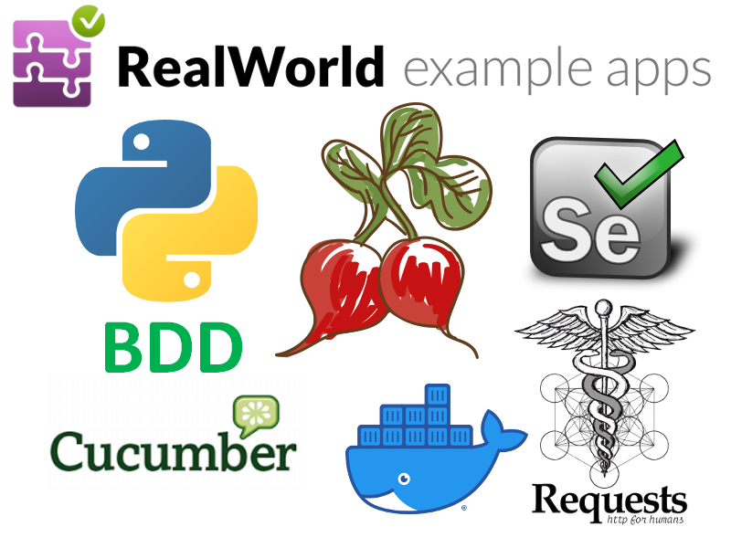
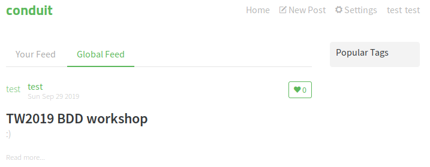
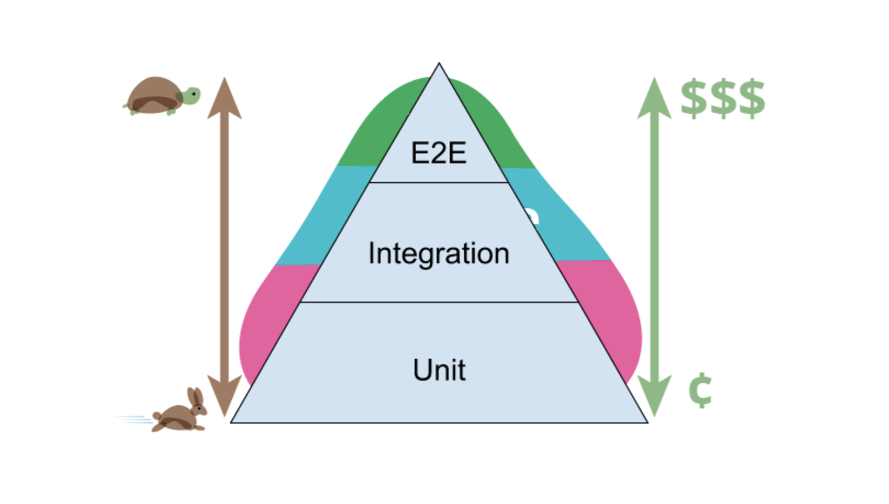

:title: TW2019 BDD workshop

.. :skip-help: true

:css: css/my.css

.. header::
    Testowanie BDD web aplikacji przy użyciu python'a oraz docker'a

.. footer::
    Dariusz Duleba & Bartosz Bielicki, TestWarez 2019

----

----

Poznajmy się :)
---------------

.. note::
    * my zaczynamy - następny slajd
    * przedstawienie się uczestników warsztatu?
    * jakie są oczekiwania uczestników?
    * jaki jest ich poziom wiedzy?

----

================================== ============
O nas
================================== ============
.. image:: img/Dariusz-Duleba.jpg  .. image:: img/Bartosz-Bielicki.jpg
Dariusz Duleba                     Bartosz Bielicki
Software Engineer at Nokia         DevOps Engineer at Huuuge Games
================================== ============

----

Wprowadzenie
------------
O czym i co tak na prawdę będziemy robić?

.. note::
    * 2 bloki
    * jedna przerwa w każdym bloku? (10 min) - ustalimy jeśli będzie potrzebna
    * niejasności i problemy wyjaśniamy na bieżąco

----

Konfigurowanie środowiska
-------------------------
* instalacja VirtualBox'a 5.x/6.x
* tworzenie maszyny wirtulanej na podstawie przygotowanego obrazu - 15 GB (hasło: tw2019)
* rozwiązywanie problemów

----

Zapoznanie się ze środowiskiem
------------------------------
* środowisko działa offline
* wszytskie materiały dostępne są na GitHub
* źródła_prezentacji_
* Ubuntu Mate 18.04.3
* python 3
* PyCharm

----

Zapoznanie się z aplikacją
--------------------------
* aplikacja testowa na podstawie realworld_
* źródła_aplikacji_testowej_
* aplikacja jest skonteneryzowana
* frontend: react + redux
* backend: flask
* db: postgres
* docker-compose
* start-app.sh
* stop-app.sh
* http://127.0.0.1

----

Zapoznanie się z aplikacją
--------------------------

----

Piramida testów
---------------

https://i2.wp.com/ucgosu.pl/wp-content/uploads/2018/09/test_pyramid.png?ssl=1

.. note::
    * Przerwa jeśli będzie potrzebna i czas pozwoli - 10 min

----

Testy integracyjne
------------------
* źródła_testów_integracyjnych_
* z wykorzystaniem nokia_radish_bdd_extensions_

Czego się nauczymy:
===================
#. jak utworzyć wirtualne środowisko python'a
#. jak zaimplementować własnego REST klienta
#. jak wykorzystać klienta i napisać własne testy integracyjne (backend + db)
#. jak wygenerować raport z testów
#. jak debugować testy z użyciem PyCharm

.. note::
    * Jest to dobre wprowadzenie do środowiska przed przejściem do bardziej skomplikowanej implementacji testów, które wykorzystują BDD (gherkin) oraz selenium.

----

Python venv
-----------
.. code-block:: Bash

    $ python3 -m venv .env
    $ . .env/bin/activate
    $ pip install -U pip wheel
    $ pip install -r requirements.txt
    ...
    $ deactivate

----

Conduit REST klient
-------------------
https://github.com/bbielicki/tw2019-app-client/blob/master/conduit/client.py

----

Testy integracyjne - scenariusze
--------------------------------
* rejestracja użytkownika
* powtórna rejestracja użytkownika
* pobranie informacji o zalogowanym użytkowniku
* artykuł dostępny dla niezalogowanego użytkownika
* polubienie artykułu - ćwiczenie

----

Raport z testów
---------------
.. code-block:: Bash

    $ nosetests --with-xunit test.backend

----

Debugowanie testów
------------------

----

Q&A
---
.. note::
    * przerwa obiadowa

----

Testy UI
---------
* źródła_testów_ui_
* z wykorzystaniem nokia_radish_bdd_extensions_ oraz _źródła_testów_integracyjnych

Czego się nauczymy:
===================
#. trzochę teorii: BDD, Gherkin, radish, selenium, page object pattern, ...
#. jak napisać własne testy używając radish framework
#. poznamy kolejne funkcjonalności nokia_radish_bdd_extensions_
#. jak odpalać testy selenium wykorzystując selenium docker image
#. jak wygenerować raport z testów zaimplementowanych przy użyciu radish framework

.. note::
    * testy będą podobne do testów integracyjnych ale będą to testy E2E/UI wykorzystujące przeglądarkę

----

Behaviour-Driven Development
============================
**Behaviour-Driven Development** (BDD)
    is the software development process that Cucumber was built to support.

What is **BDD**?

BDD is a way for software teams to work that closes the gap between business people and technical people by:

* Encouraging collaboration across roles to build shared understanding of the the problem to be solved
* Working in rapid, small iterations to increase feedback and the flow of value
* Producing system documentation that is automatically checked against the system’s behaviour

We do this by focussing collaborative work around concrete, real-world examples that illustrate how we want the system to behave. We use those examples to guide us from concept through to implementation, in a process of continuous collaboration.

.. note::
    https://cucumber.io/docs/bdd/

----

Gherkin
-------
Gherkin is a Business Readable, Domain Specific Language created especially for behavior descriptions. It gives you the ability to remove logic details from behavior tests.

.. note::
    https://docs.behat.org/en/v2.5/guides/1.gherkin.html
    https://cucumber.io/docs/gherkin/reference/

----

radish
------

radish is a Behavior Driven Development tool completely written in python.

Gherkin compatible
    radish is fully compatible with cucumber's Gherkin language.

Additional feature syntax
    In addition to the fully supported Gherkin language radish supports some more functionality like: Scenario Preconditions, Scenario Loops, Variables and Expressions.

Pythonic
    radish tries to provide the most awesome pythonic experiences when implementing your steps and hooks. Your test code should be as great as your project's code.

.. note::
    http://radish-bdd.io/
    https://radish.readthedocs.io/en/stable/tutorial.html

----

Front End testing
=================

selenium
--------

Selenium automates browsers. That's it! What you do with that power is entirely up to you. Primarily, it is for automating web applications for testing purposes, but is certainly not limited to just that. Boring web-based administration tasks can (and should!) be automated as well.

Selenium has the support of some of the largest browser vendors who have taken (or are taking) steps to make Selenium a native part of their browser. It is also the core technology in countless other browser automation tools, APIs and frameworks.

.. note::
    https://www.seleniumhq.org
    https://selenium-python.readthedocs.io/

----

selenium docker* polubienie artykułu

---------------

.. code::

    $ docker run -d -p 4444:4444 -v /dev/shm:/dev/shm selenium/standalone-chrome:3.141.59-vanadium
    $ docker run --network host --name selenium --restart unless-stopped -d -p 4444:4444 -v /dev/shm:/dev/shm selenium/standalone-chrome:latest

.. note::
    https://github.com/SeleniumHQ/docker-selenium

----E2E

testcontainers-python
---------------------

python-testcontainers provides capabilities to spin up a docker containers for test purposes would that be a database, Selenium web browser or any other cotainer.

.. note::
    https://github.com/testcontainers/testcontainers-python

----

Other selenium docker compilations
----------------------------------

* selenoid
* zalenium

.. note::
    https://github.com/aerokube/selenoid
    https://opensource.zalando.com/zalenium/

----

* logs attaching
    * in case of error handling
        * attach page source
        * attach page screenshot
        * attach page console logs
    * additional logging

-----

Page object pattern
-------------------

Page Objects are a testing pattern for websites. Page Objects model a page on your site to provide accessors and methods for interacting with this page, both to reduce boilerplate and provide a single place for element locators.

.. note::
    https://github.com/eeaston/page-objects
    https://pypi.org/project/page-objects/

----

Testy UI - scenariusze
----------------------
* rejestracja użytkownika
* rejestracja użytkownika ze znakami specjalnymi
* logowanie użytkownika
* błędne logowanie użytkownika
* tworzenie artykułu
* artykuł dostępny dla niezalogowanego użytkownika - ćwiczenie

----

Q&A
---

.. _źródła_prezentacji: https://github.com/bbielicki/tw2019-workshop
.. _realworld: https://github.com/gothinkster/realworld
.. _źródła_aplikacji_testowej: https://github.com/bbielicki/tw2019-app
.. _źródła_testów_integracyjnych: https://github.com/bbielicki/tw2019-app-client
.. _nokia_radish_bdd_extensions: https://github.com/nokia/radish-bdd-extensions
.. _źródła_testów_ui: https://github.com/dduleba/tw2019-ui-tests
